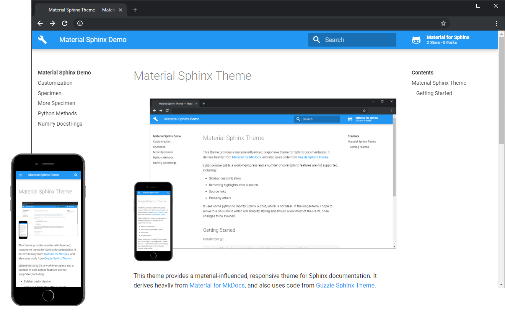

=====================
Material Sphinx Theme
=====================

This theme provides a material-influenced, responsive theme for Sphinx
documentation. It derives heavily from
`Material for MkDocs <https://squidfunk.github.io/mkdocs-material/>`_,
and also uses code from
`Guzzle Sphinx Theme <https://github.com/guzzle/guzzle_sphinx_theme>`_.

``sphinx-material`` is a work-in-progress and a number of core Sphinx features
are not supported, including:

* Sidebar customization
* Probably others

It uses some python to modify Sphinx output, which is not ideal. In the
longer-term, I hope to move to a SASS build which will simplify styling and
should allow most of the HTML code changes to be avoided.

.. toctree::
    :hidden:

    customization
    specimen
    additional_samples
    pymethod
    numpydoc

Getting Started
---------------
Install from git

.. code-block:: bash

   pip install git+https://github.com/bashtage/sphinx-material.git

Update your ``conf.py`` with the required changes:

.. code-block:: python

    import sphinx_material

     # Register the theme as an extension to generate a sitemap.xml
    extensions.append('sphinx_material')

    # Choose the material theme
    html_theme = 'sphinx_material'
    # Get the them path
    html_theme_path = sphinx_material.html_theme_path()
    # Register the required helpers for the html context
    html_context = sphinx_material.get_html_context()

There are a lot more ways to customize this theme. See :ref:`Customization`
or ``theme.conf`` for more details.

.. code-block:: python

    import sphinx_material

    # # Required theme setup
    extensions.append('sphinx_material')
    html_theme = 'sphinx_material'
    html_theme_path = sphinx_material.html_theme_path()
    html_context = sphinx_material.get_html_context()

    # Material theme options (see theme.conf for more information)
    html_theme_options = {

        # Set the name of the project to appear in the navigation.
        'nav_name': 'Project Name',

        # Set you GA account ID to enable tracking
        'google_analytics_account': 'UA-XXXXX',

        # Specify a base_url used to generate sitemap.xml. If not
        # specified, then no sitemap will be built.
        'base_url': 'https://project.github.io/project',

        # Set the color and the accent color
        'color_primary': 'blue',
        'color_accent': 'light-blue'

        # Set the repo location to get a badge with stats
        'repo_url': 'https://github.com/project/project/',
        'repo_name': 'Project',

        # Visible levels of the global TOC; -1 means unlimited
        'globaltoc_depth': 3,
        # If False, expand all TOC entries
        'globaltoc_collapse': False,
        # If True, show hidden TOC entries
        'globaltoc_includehidden': False,
    }
